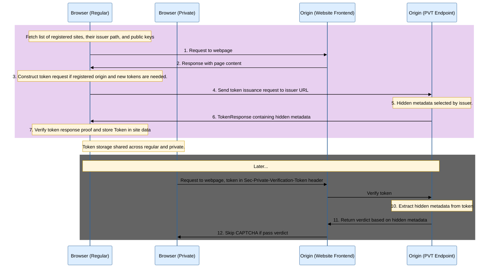
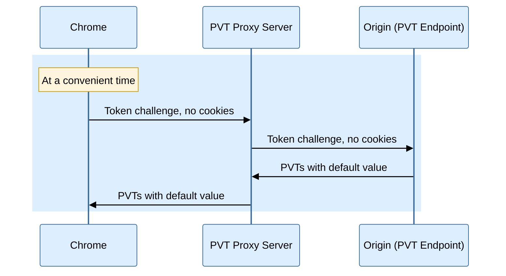

# Explainer for the Private Verification Tokens

This proposal is an early design sketch by Chrome PVT team to describe the
problem below and solicit feedback on the proposed solution. It has not been
approved to ship in Chrome.

## Proponents

- Chrome PVT team

## Participate
- https://github.com/explainers-by-googlers/private-verification-tokens/issues

## Table of Contents

<!-- Update this table of contents by running `npx doctoc README.md` -->
<!-- START doctoc generated TOC please keep comment here to allow auto update -->
<!-- DON'T EDIT THIS SECTION, INSTEAD RE-RUN doctoc TO UPDATE -->

- [Introduction](#introduction)
- [Goals](#goals)
- [Overview](#overview)
  - [Token Issuance](#token-issuance)
  - [Token Redemption](#token-redemption)
  - [Initializing PVT Cache](#initializing-pvt-cache)
- [Request/Response Details](#requestresponse-details)
  - [Token Issuance](#token-issuance-1)
  - [Token Redemption](#token-redemption-1)
- [Obtaining Public Keys and Key Rotation](#obtaining-public-keys-and-key-rotation)
- [Registration Process](#registration-process)
- [Privacy Considerations](#privacy-considerations)
  - [Data Persistence](#data-persistence)
  - [Unlinkability](#unlinkability)
  - [Limits on Key/Token Expiration](#limits-on-keytoken-expiration)
  - [Limiting Distinct eTLD+1 for a Given Private Mode Session](#limiting-distinct-etld1-for-a-given-private-mode-session)
  - [Token Capacity](#token-capacity)
  - [Private Mode Detectability](#private-mode-detectability)
- [Comparison to PACT](#comparison-to-pact)

<!-- END doctoc generated TOC please keep comment here to allow auto update -->

## Introduction

Private Verification Tokens (PVT) is a low-entropy mechanism for users to
transfer the trust they have established in regular browsing into private
browsing mode to reduce their experienced friction.

## Goals

Automated traffic is increasing across the web, and many websites have responded
by adding more user friction to combat unwanted traffic. Added challenges like
CAPTCHAs degrade the web user experience for all users, with a particularly
outsized impact to users in private browsing modes, i.e., modes where session
data is cleared at exit. That’s because automation in the form of crawlers,
bots, agents, will sometimes employ tactics like clearing their state and
rotating their fingerprints, to appear as a new user.  Unfortunately, these
automated clients appear very similar to users in private browsing modes who
also have a newly cleared state, and so sites, unable to differentiate the two
groups, prompt both with challenges to detect bots or assert humanness verdicts.

We propose Private Verification Tokens (PVT) as a low-entropy mechanism for
users to transfer the trust they have established in regular browsing into
private browsing mode to reduce their experienced user friction.

PVTs can be considered as a solution to a subset of the requirements listed in
the [PACT proposal](https://github.com/antifraudcg/proposals/issues/22). 
We believe experimentation in this area may help in broader
development of open and private ecosystem solutions, as PACT aims to do. For a
detailed comparison see section titled "Comparison to PACT".

## Overview

The motivation is to address a spike in latency and increase in challenges for
users in private browser mode, which regrettably often appear indistinguishable
from bots who also clear state or use private browsing.  The idea is to transfer
trust the user has from the regular browsing to the incognito, using as little
entropy as necessary to preserve user privacy while significantly reducing
friction. PVTs are based on [Anonymous Tokens with Hidden Metadata
(ATHM)](https://www.ietf.org/archive/id/draft-yun-cfrg-athm-00.html)
protocol. PVTs are issued during a regular browsing session and redeemed in
private browsing mode, and are tied to top level origin's [eTLD +
1](https://developer.mozilla.org/en-US/docs/Glossary/Registrable_domain). That
is, tokens can only be issued and redeemed by the origins that have the same
eTLD+1, and data can only go into private browsing; it cannot be exfiltrated
from private browsing to regular browsing.

Top-level Websites are required to register to be able to issue PVTs. The
registration process requires accepting a policy that states the PVTs are used
for trust, rate limiting and IVT detection purposes and the process will be
similar to [Private State Token (PST)
registration](https://github.com/GoogleChrome/private-tokens/blob/main/PST-Registration.md).
We say an origin/publisher/page is registered if its eTLD+1 is registered.



### Token Issuance

During regular browsing, when the user navigates to a registered page, the
browser creates a PVT request to the registered endpoint. The browser stores the
returned PVTs to redeem during private browsing mode.

The browser sends a token challenge when the following conditions are met.
* The browser is in the process of creating a request to an origin with https
  scheme where eTLD+1 is registered.
* The request is created in a regular browsing session. Meaning persisting data
  after the page is closed is appropriate.
* The number of existing tokens for the corresponding eTLD+1 is below a
  threshold. The browser creates a token request only if it needs more
  tokens. This ensures token freshness.
* The tokens that the browser has will expire soon. This is to prevent the
  browser going out of tokens. Browser creates the challenge before it is out of
  tokens.

### Token Redemption

A no-cookie request to a registered origin will have a PVT attached if the
browser has one. This assumes the browser already has a PVT for the origin. To
ensure that the browser has a PVT when the user navigates to it for the first
time, we propose [initializing the PVT cache](#initializing-pvt-cache).

In the private browsing session, since the first request to a registered origin
has no cookie, it will have a PVT in the `Sec-Private-Verification-Token`
header. Only one PVT will be sent to a registered origin during the same private
browsing session.

More specifically, browsers adds a token when the following conditions are met.

* The request has no cookie.
* The origin's scheme is https.
* The browser parent profile has at least one token for the origin.
* Tokens are not expired.

An origin can prevent burning all their PVTs by setting a cookie upon receiving
a PVT. Browser will keep adding PVTs until no PVT is left.

### Initializing PVT Cache

In the [Privacy Considerations](#privacy-considerations) section, we discuss a
potential method where PVTs could be used to detect private mode sessions. To
mitigate this, we propose prefetching tokens at browser startup to ensure that
browsers always have access to a supply of PVTs, such that they are present both
in private mode and upon the first visit of a user to the site. However, this
mechanism itself could theoretically be used by a website to identify the entire
browser fleet. To mitigate this, browser implementations should proxy the
requests for tokens through a PVT proxy server run by the browser.

The PVT cache can be initialized by prefetching PVTs. For this we propose to
have a dedicated server that will request PVTs on the user's behalf. The browser
should schedule the token challenge requests properly to prevent overloading PVT
proxy server and Origin (PVT Endpoint). PVT Proxy Server should identify itself
as the PVT Proxy. PVT endpoints are required to respond to PVT Proxy Server
token requests.



## Request/Response Details

### Token Issuance

Token challenge requests will be in the following form.

```
POST /page-specified-pvt-issuer-path HTTP/1.1
Host: examplehost.com
Accept: application/private-token-response
Content-Type: application/private-token-request
Content-Length: <Length of TokenRequest>

<Bytes containing the TokenRequest>
```

A HTTP response that contains tokens is expected. Response should be in the following form.

```
HTTP/1.1 200 OK
Content-Type: application/private-token-response
Content-Length: <Length of TokenResponse>

<Bytes containing the TokenResponse>
```

The browser stores tokens on disk to persist between restarts.

### Token Redemption

Tokens are added to the `Sec-Private-Verification-Tokens` header. This header will
contain a base64 encoding of a single serialized token. PVTs are serialized
following [rfc9578#section-5.3](https://www.rfc-editor.org/rfc/rfc9578.html#section-5.3).

## Obtaining Public Keys and Key Rotation

ATHM requires public keys being distributed to the browsers before creating
token requests. This can be achieved through mechanisms similar to [component
updater](https://chromium.googlesource.com/chromium/src/+/lkgr/components/component_updater/README.md)
in Chrome's case.

The browser should reject keys that expire too soon for privacy reasons. Keys
should expire late enough to prevent classifying users based on the key versions
they have.

## Registration Process

PVTs will work for the registered origins. Registration process is TBD and will
be added here once finalized. The list of registered eTLD+1s can be pushed to
the browsers together with public keys through mechanisms similar to Chrome's
[component updater](https://chromium.googlesource.com/chromium/src/+/lkgr/components/component_updater/README.md).

## Privacy Considerations

### Data Persistence

Existing data persistence requirements should apply with the PVTs
stored. Origins blocked for data persistence should not be able to store
tokens. Browsers should implement UI to clear existing tokens. Browsers should
implement UI to opt-out of PVTs altogether.

### Unlinkability

ATHMs with the same metadata are unlinkable, meaning the origins receiving a PVT
will not be able to associate the user to the issuance context just based on the
token at redemption time.

### Limits on Key/Token Expiration

Tokens expire when corresponding keys expire. Browsers should not accept keys
that have too short or long key expiration times.

### Limiting Distinct eTLD+1 for a Given Private Mode Session

Browsers should limit the number of distinct eTLD+1s observed for token
redemptions for a given private mode session. This is to prevent a single entity
controlling multiple registered eTLD+1s to exfiltrate more signals than
intended. This limitation can be considered similar to [Firefox's bounce
tracking
mitigation](https://developer.mozilla.org/en-US/docs/Web/Privacy/Guides/Bounce_tracking_mitigations),
but uses a deterministic rule rather than a heuristic one. We believe this
simple rule is good enough to start. We propose to use 2 as the limit, i.e. only
the first 2 distinct registered eTLD+1 will get PVT for a given private mode
session.

### Token Capacity

We propose to encode a single bit in the tokens
([nBuckets](https://www.ietf.org/archive/id/draft-yun-cfrg-athm-00.html#section-5.1) = 2).

### Private Mode Detectability

We add PVTs to any request that has no cookie. This prevents the origin
determining whether the user is in a private mode session or not. The PVT cache
will be initialized using the method proposed in section [Initializing PVT Cache](#initializing-pvt-cache).

## Comparison to PACT

PVTs aims to experiment with use of trust signals to reduce user friction, much
like the [PACT proposal](https://github.com/antifraudcg/proposals/issues/22)
which is being incubated in Anti-Fraud Community Group (AFCG). The authors see
this proposal as an opportunity for early experimentation where we’ve defined a
reduced problem statement that is better scoped and easier to crack, and can be
considered a stepping stone towards achievement of the PACT requirements.


The following table lists the requirements of the PACT proposal and whether PVTs
satisfy the requirement. Note that PACT does not necessarily assume the
trust/rate limiting signals are created and consumed by the same party. PVTs are
designed for this.

|Requirement             | Do PVTs Satisfy? |
|:-----------------------|:-----------------|
|Open to participation   |Partially for token issuers, publishers must accept the registration policy. Further, there is no limitation on who can become an issuer, but given the narrow nature of the use case, we do not expect as much issuer adoption as PACT. |
|Effective Rate Limiting |Partially, publishers can control rate limiting by controlling the token supply. |
|Blocking                | No |
|Feedback                | No |
|Frictionless Challenges | Yes |
|Unlinkability           | Yes |
|Minimal Information Leakage | Yes, though entropy limits have not yet been defined in PACT |
|Computationally Efficient| Yes, compared to Proof of Work.|
|Minimal Coordination | NA, publisher, issuer and redeemer is a single entity.|
|Collusion Resistance | Yes, due to the limit of at most 2 distinct publishers per private browsing session. See privacy section. |
|Abuse Resistant |Publisher accepts a policy to encode only trust and rate limiting signals during registration.|


It is also worth mentioning another main difference: PACT proposes a low entropy
signal that is available across top level and in 3P contexts. PVTs are only
available on a single top level and will only cross the private browsing context
(low entropy data in, no data out).

